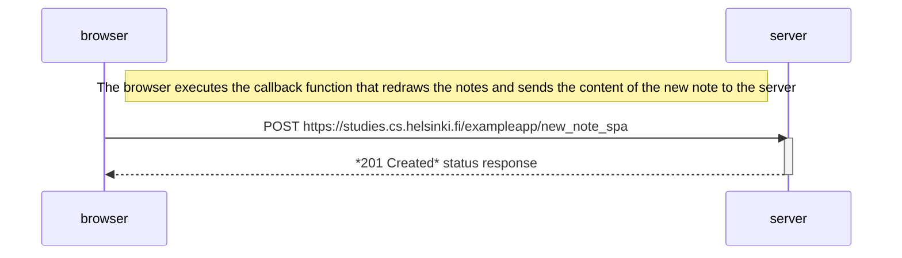

```mermaid
sequenceDiagram
    participant browser
    participant server

    Note right of browser: The browser executes the callback function that redraws the notes and sends the content of the new note to the server
    browser->>server: POST https://studies.cs.helsinki.fi/exampleapp/new_note_spa
    activate server
    server-->>browser: *201 Created* status response
    deactivate server
```
